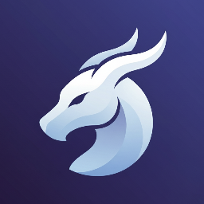

  
  # 
 SynthX Development — Official Legal & Governance Portal

  <strong>The Official Legal Framework, Compliance Documentation & Terms of Service for SynthX Systems</strong>

  
  
  
  

---

## 🏛️ Legal & Governance Suite

This repository serves as the authoritative, legally binding governance documentation for all bot instances, services, custom deployments, and client commissions provided by **SynthX Development**.

| Document | Description | Direct Link |
| :--- | :--- | :---: |
| **Terms of Service** | Comprehensive conditions of use, disclaimers of warranty, strict liability caps ($10 USD), indemnification, and anti-abuse policies. | [**TERMS_OF_SERVICE.md**](./TERMS_OF_SERVICE.md) |
| **Privacy Policy** | Full transparency on data collection, Discord Snowflake handling, Data Controller vs Processor delineation, and GDPR / CCPA deletion workflows. | [**PRIVACY_POLICY.md**](./PRIVACY_POLICY.md) |
| **Commission & Client Terms** | Terms governing freelance custom bot builds, independent contractor protections, non-payment breach clauses, and retained copyright. | [**COMMISSION_AND_FREELANCE_TERMS.md**](./COMMISSION_AND_FREELANCE_TERMS.md) |
| **Proprietary License** | Intellectual property terms, source-available restrictions, and DMCA enforcement mechanisms. | [**LICENSE**](./LICENSE) |

---

## 🛡️ Key Legal Protections for Developers & Clients

1. **Strict Limitation of Liability & Caps**:
   - Total cumulative developer liability is explicitly capped to the amount paid in the preceding 30 days or $10.00 USD, whichever is less.
   - Comprehensive disclaimer of all warranties ("AS IS" and "AS AVAILABLE").
2. **Indemnification (Defense of Developer)**:
   - Users and server owners agree to defend, indemnify, and hold harmless the Developer from any third-party claims, lawsuits, or server damages arising from their community operations.
3. **Independent Contractor Status**:
   - The Developer is an independent software provider with **zero legal affiliation, ownership, or liability** regarding client server operations, staff conduct, or member disputes.
4. **Non-Payment Revocation & DMCA Rights**:
   - If a client withholds payment or initiates a chargeback under subjective claims (such as "it took no effort"), all deployment permissions are automatically revoked, and continued hosting constitutes willful copyright infringement subject to immediate DMCA takedown.

---

## 🤖 Platform Compliance

SynthX documentation is drafted in strict adherence to:
- **Discord Developer Terms of Service**: [https://discord.com/terms](https://discord.com/terms)
- **Discord Developer Policy**: [https://discord.com/developers/docs/policies-and-agreements/developer-policy](https://discord.com/developers/docs/policies-and-agreements/developer-policy)
- **Discord Community Guidelines**: [https://discord.com/guidelines](https://discord.com/guidelines)
- **OpenAI Usage Policies**: [https://openai.com/policies/usage-policies](https://openai.com/policies/usage-policies)

---

## 📬 Legal Contact & DMCA Agent

For formal legal inquiries, DMCA takedown submissions, or Data Subject Access Requests (DSAR):
- **Primary Developer & Copyright Owner:** sae (`saecodess` / SynthX Development)
- **Official Legal Email:** `suhansalian740@gmail.com`
- **Discord Support Server:** [https://discord.gg/WKX5HHPmWz](https://discord.gg/WKX5HHPmWz)
